# 🚦 피싱 신호등 (PhishingSignal) — MCP Server

[](https://github.com/DO-MADO/phishing-signal-mcp/actions/workflows/ci.yml)
[](LICENSE)
[](package.json)
[](SPEC.md)


<code>**사기가 도착한 바로 그 대화 안에서, 송금·인증번호·앱설치 직전에 끼어들어 멈춰 세우는 30초 안전 브레이크.**</code>

<br>

수상한 전화·문자·메신저 내용을 붙여넣으면 송금·앱설치·인증번호 공유 전에 먼저 멈추게 하고, <br>
보이스피싱 **위험도와 근거**, **지금 해야 할 행동**, **공식 신고 루트**를 안내합니다. <br>
대화형 AI·메신저(MCP 호스트) 안에서 동작하므로 **별도 앱 설치 없이 사기가 일어나는 그 자리에서** 바로 판단합니다.

<hr>

> 판정은 LLM 호출이 아니라 **결정적(deterministic) 규칙 엔진**으로 수행합니다.  <br>
> (응답 100ms 목표·무과금·일관성) ➪ 자세한 제품/규정/확정값은 [SPEC.md](SPEC.md)를 참고하세요.

<br>

## ⚡ 바로 사용해보기 (PlayMCP)

설치 없이 카카오 PlayMCP에서 바로 써볼 수 있습니다.

1. **[PlayMCP의 "피싱 신호등" 페이지](https://playmcp.kakao.com/mcp/65443294678677425)** 에서 도구함에 담기
2. PlayMCP의 **AI 채팅** (또는 도구함을 연결한 Claude·ChatGPT 등)을 열기
3. 의심스러운 문자·통화 내용을 **그대로 붙여넣고** 물어보기

> 💬 이렇게 물어보세요 : "엄마가 이런 문자 받았는데 사기야? → *(받은 문자 붙여넣기)*" <br>
> 아래 [합성 데모 샘플](#-바로-해보기-합성-데모-샘플)을 그대로 복사해서 테스트해도 됩니다.

<br>

## 🔴 실제 응답 예시

합성 입력(실제 번호·계좌 없음) 하나를 실제 서버에 호출한 **응답 원문**입니다.

**입력** : `서울중앙지검 수사관입니다. 귀하 명의 계좌가 범죄에 연루되어 즉시 안전계좌로 자산을 이동해야 합니다. 지금 알려드리는 계좌로 송금하고, 본인 확인을 위해 방금 발송된 인증번호를 알려주십시오. 불응 시 구속영장이 청구됩니다.`

<details>
<summary><b>📩 응답 원문 펼치기</b> — 30초 안전 브레이크 → 🔴 매우 높음 → 행동 가이드 → 근거 → 가족 공유 문구 → 신고 루트</summary>

<br>

> ## 30초 안전 브레이크
> - 지금은 즉시 멈춰야 합니다.
> - 링크 클릭, 앱 설치, 송금, 인증번호 공유를 하지 마세요.
>
> ### 🔴 위험도: 매우 높음
>
> ### 지금 하지 말아야 할 행동
> - 인증번호(OTP)·비밀번호·계좌번호·신분증 정보를 알려주지 마세요.
> - 상대가 보낸 링크를 누르거나 첨부 파일을 열지 마세요.
> - 상대가 안내하는 앱(원격제어·보안앱 등)을 설치하지 마세요.
> - 재촉에 떠밀려 송금/이체하지 마세요.
>
> ### 지금 해야 할 행동
> - 기관·지인 여부는 공식 대표번호 또는 기존 연락처로 직접 확인하세요.
> - 통화기록·문자·대화 내용 등 남아 있는 기록은 삭제하지 말고 보존한 뒤 아래 채널로 신고/상담하세요.
>
> ### 왜 위험한가요?
> - **기관·가족/지인 사칭**: 기관·가족·지인처럼 보이게 만들어 신뢰나 권위로 압박하는 신호입니다. 근거: 중앙지검, 수사관
> - **위험 행동 요구**: 인증번호, 원격제어, 상품권 코드처럼 피해로 이어질 수 있는 행동을 요구하는 신호입니다. 근거: 인증번호
> - **긴급성 압박**: 즉시 처리하라는 표현으로 사용자의 판단 시간을 줄이는 압박 신호입니다. 근거: 즉시, 구속, 지금
> - **금전 피해 가능성**: 송금, 이체, 상품권 구매처럼 금전 피해로 이어질 수 있는 요구 신호입니다. 근거: 안전계좌, 송금
> - **개인정보 탈취**: 계좌번호, 비밀번호, 신분증 등 민감정보 탈취로 이어질 수 있는 신호입니다. 근거: 계좌로 자산을 이동해야 합니다[.] …
>
> ### 가족에게 공유할 문구
> 검찰·경찰·금감원·은행은 전화나 메시지로 앱 설치, 인증번호, 송금을 요구하지 않습니다. 수상한 연락을 받으면 먼저 멈추고 가족 또는 공식 번호로 확인하세요.
>
> ### 공식 신고 루트
> 1. **전기통신금융사기 통합대응단 신고대응센터** (1394) — 피싱 여부 확인·제보(24시간)
> 2. **KISA 상담센터** (118) — 스미싱·불법스팸·의심문자 상담/신고
>
> > ⚠️ OTP·비밀번호·주민번호·여권번호·계좌번호 등 민감정보는 이 대화에 입력하지 마세요.
>
> > 이 안내는 위험 신호에 대한 참고용 가이드이며 법적 판단이 아닙니다. 실제 상황에서는 공식 기관과 금융회사의 안내를 우선하세요.

</details>

같은 입력에는 항상 같은 근거·결과가 나오는 **결정적(deterministic) 판정**이라, 위 응답은 누구나 동일하게 재현할 수 있습니다.

<br>

## 👨‍👩‍👧 가족에게 공유 — 탐지에서 보호로

위험도가 🟠 높음 · 🔴 매우 높음이면 응답에 **가족에게 공유할 문구**가 자동 포함됩니다. <br>
그대로 복사해 부모님 채팅방에 보내는 것만으로, 탐지가 가족 보호로 이어집니다.


<br>

## 🧭 포지셔닝

피싱 신호등은 단순 탐지기가 아니라, <br> 수상한 연락을 받았을 때 피해 행동 직전에 사용자를 멈춰 세우는 **30초 안전 브레이크**를 목표로 합니다.


<ins>위험 신호가 있는 응답</ins>은 다음 순서로 구성됩니다.

1. 30초 안전 브레이크 : 링크 클릭, 앱 설치, 송금, 인증번호 공유 중단 안내
   
2. 위험도 : 낮음/주의/높음/매우 높음
   
3. 지금 하지 말아야 할 행동
   
4. 지금 해야 할 행동
   
5. 왜 위험한가요? : 탐지 신호를 심리 압박/위험 행동 관점으로 설명
    
6. 공식 신고 루트


<br>


## 🖼️ UX 프리뷰

> MCP 응답이 호스트 앱에서 <ins>어떻게 보일지 나타낸 디자인 프리뷰</ins>입니다(실제 서버는 정제된 Markdown을 반환) <br> **위험 결과는 위험도가 아니라 '멈춤 명령'으로 시작**하고, 정상(낮음)은 겁주지 않고 차분히 안내합니다. <br> 위험도는 신호등 4색(🟢 낮음 · 🟡 주의 · 🟠 높음 · 🔴 매우 높음)으로 구분합니다.

<table>
  <tr>
    <td align="center" width="25%">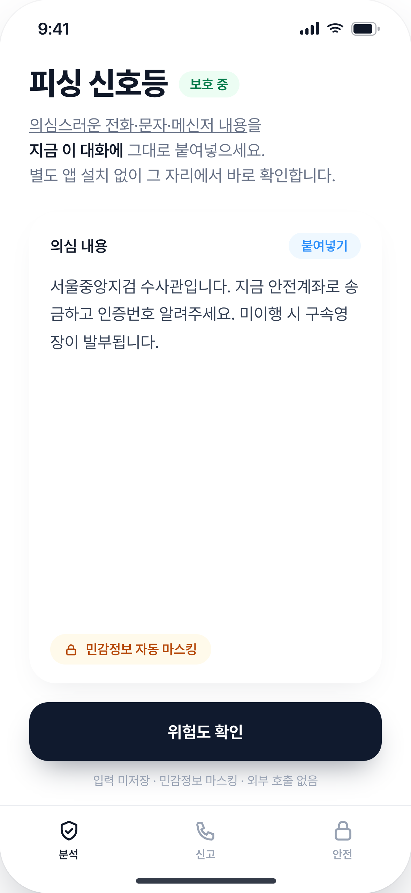<br><b>① 붙여넣기</b><br><sub>그 대화에 붙여넣으면 즉시 마스킹</sub></td>
    <td align="center" width="25%">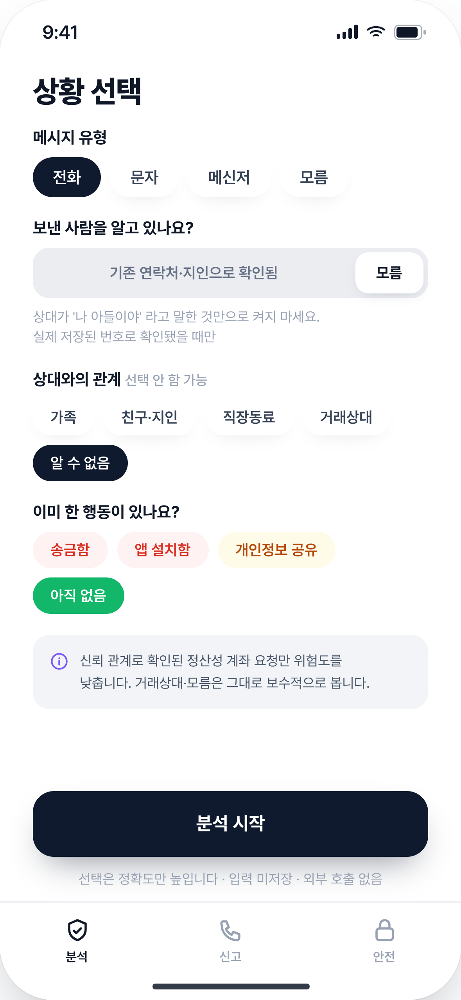<br><b>② 상황 선택</b><br><sub>신뢰 관계 확인 시에만 위험도 완화</sub></td>
    <td align="center" width="25%">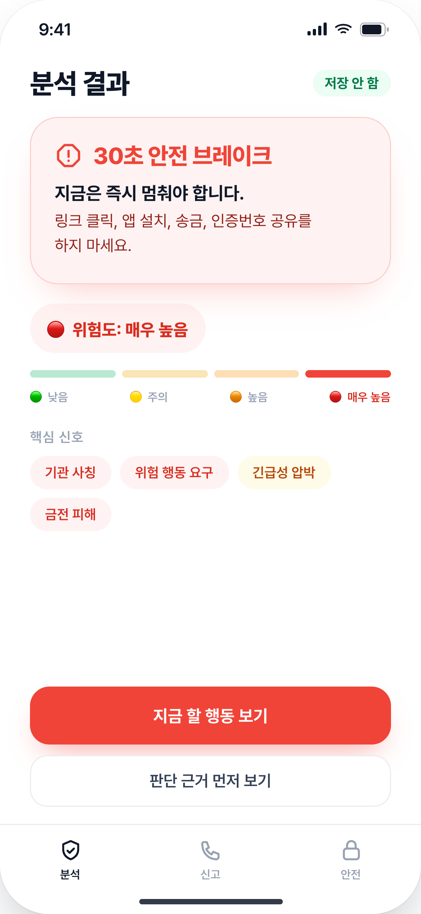<br><b>③ 분석 결과 · 위험</b><br><sub>🔴 위험도보다 멈춤 명령 먼저</sub></td>
    <td align="center" width="25%">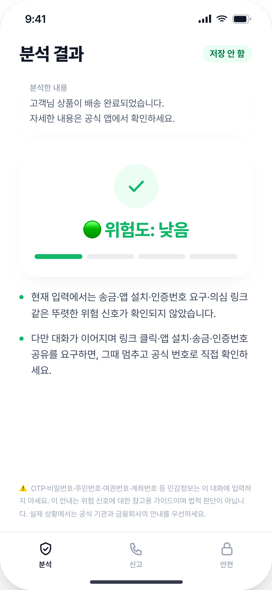<br><b>③ 분석 결과 · 정상</b><br><sub>🟢 겁주지 않고 차분하게</sub></td>
  </tr>
  <tr>
    <td align="center">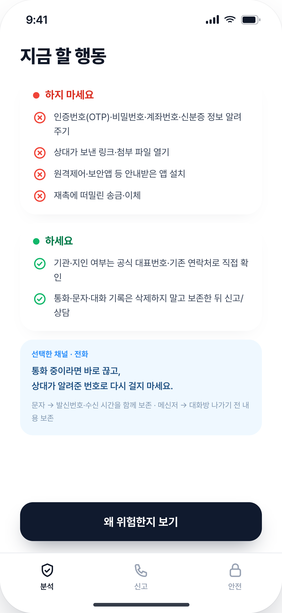<br><b>④ 행동 가이드</b><br><sub>하지 마세요 / 하세요 분리</sub></td>
    <td align="center">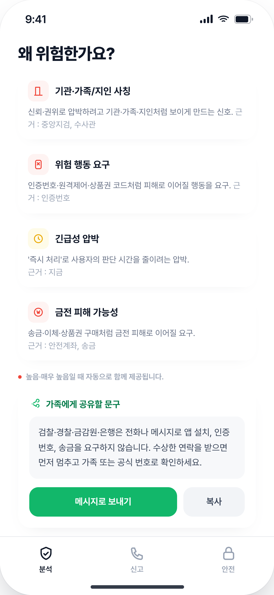<br><b>⑤ 왜 위험한가요</b><br><sub>신호 → 심리압박 번역 + 가족 공유</sub></td>
    <td align="center">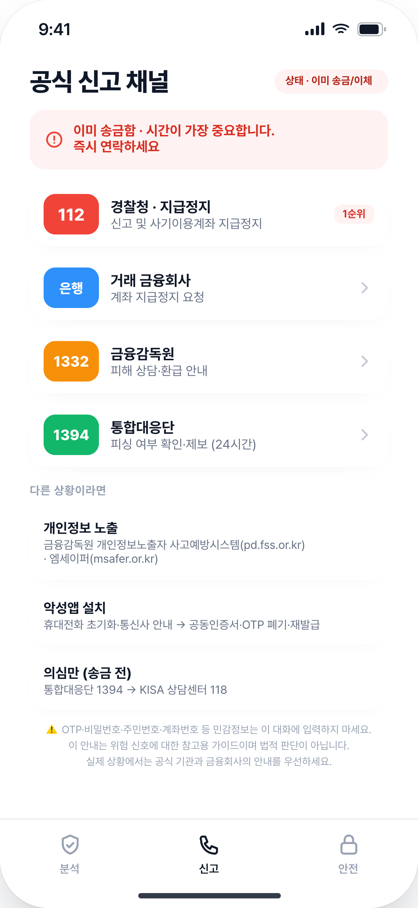<br><b>⑥ 신고 채널</b><br><sub>'이미 한 행동'에 따라 루트 분기</sub></td>
    <td align="center">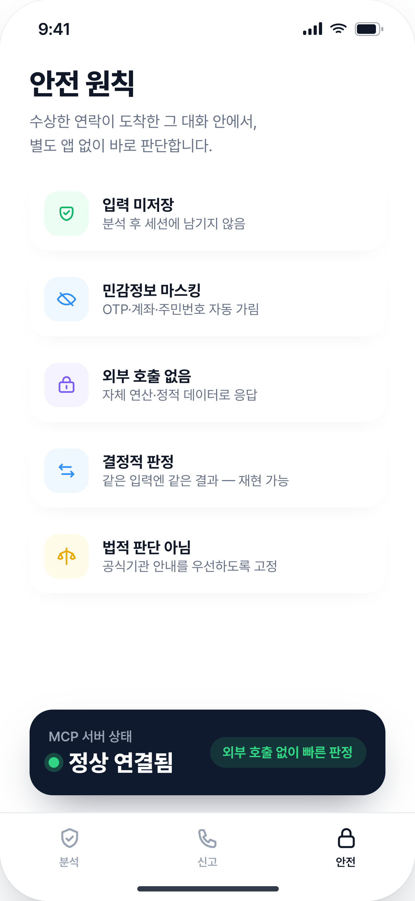<br><b>⑦ 안전 원칙</b><br><sub>미저장·마스킹·외부 호출 없음·결정적</sub></td>
  </tr>
</table>

<br>

## 🛠️ 툴 (MVP 2종)

| 이름 | 역할 |
|---|---|
| `analyzePhishingRisk` | 입력 텍스트 → 30초 안전 브레이크 → 위험도(낮음/주의/높음/매우 높음) + 근거 + 행동 가이드 |
| `getReportChannels` | 상황별 공식 신고 루트  (`suspiciousOnly`=의심만 받음, `alreadyPaid`=이미 송금, <br>  `personalInfoExposed`=개인정보 노출, `malwareInstalled`=악성앱 설치 의심) |

- 전송 : **Streamable HTTP / Remote / Stateless(no session)**
- 안전 : 입력 미저장, 민감정보 마스킹, 의심 링크 디팽, 모든 분석 출력에 디스클레이머, 응답 24k 가드
- 품질 : 공식 시나리오 기반 fixture와 adversarial 합성 샘플 회귀 테스트로, <br>
ㅤㅤㅤ가족/지인 사칭, 기관 사칭, 대출·택배·소액결제·투자/알바·악성앱 유도 유형을 점검

<br>

## 🧪 바로 해보기 (합성 데모 샘플)

> 아래는 실제 번호·계좌·URL이 없는 **합성 예시**입니다. <br>  `analyzePhishingRisk`의 `text`에 그대로 붙여 넣어 결과를 비교해 보세요.

<br>

| 입력 예시 | 기대 위험도 |
|---|---|
| 서울중앙지검 수사관입니다. 지금 안전계좌로 송금하고 인증번호 알려주세요. | 🔴 매우 높음 |
| 엄마 나 폰 깨져서 인증 안돼. 병원비 좀 보내줭 ㅠㅠ | 🟠 높음 |
| 편의점에서 구글기프트 사서 뒷면 코드 긁어 사진 보내. | 🔴 매우 높음 |
| [Web발신] CJ대한통운 주소 불일치 택배 보류. 아래에서 재입력. | 🟡 주의 |
| 고객님 상품이 배송 완료되었습니다. 자세한 내용은 공식 앱에서 확인하세요. | 🟢 낮음 |
| OTP는 누구에게도 알려주면 안 된다고 교육받았어. | 🟢 낮음 |

- **정상 문자(낮음)** 는 과한 경고 없이 한두 줄로 차분히 안내하고,  <br> **위험 문자**는 `30초 안전 브레이크 → 위험도 → 지금 하지 말아야 할 행동 → 지금 해야 할 행동 → 왜 위험한가요? → 공식 신고 루트` 순으로 응답합니다.

- `높음`/`매우 높음`에서는 `왜 위험한가요?` 뒤에 가족에게 공유할 문구가 추가됩니다.
  
- 같은 입력에는 항상 같은 근거·결과가 나오는 **결정적(deterministic) 판정**이라 검증·재현이 쉽습니다.

<br>

## 📊 품질 · 검증

판정 품질을 **CI가 매 커밋 강제하는 불변식**과 **회귀 테스트에 쓰지 않은 held-out 세트로 측정한 일반화 성능**으로 나눠 공개합니다. <br> 모든 수치는 외부 호출 없는 결정적 엔진 측정값이며, `npm run report`로 [docs/QUALITY_REPORT.md](docs/QUALITY_REPORT.md)에서 재현됩니다.


| 구분 | 지표 | 값 |
|---|---|---|
| **CI 강제 불변식** <br>(매 커밋 단언) | 정상 문장 과잉경고 | **0건** (0/187) |
| | 공격 문장 경고 임계값 이상 | **100%** (286/286) |
| | 신호 재현율(Recall) | **100%** (89/89) |
| **Held-out 일반화** <br>(엔진이 본 적 없는 신규 샘플, n=40) | 탐지율(Recall) | **86.4%** (19/22) |
| | 정밀도(Precision) | 79.2% (19/24) |
| **측정 지표** | 위험도 정확 일치율 | 76.3% (251/329) |
| **보수적 방향성** | 회귀셋 미탐(under-call) | **0건** — 모든 불일치가 더 위험하게 본 방향 |

- **CI 강제 불변식**의 100% 수치는 *측정된 일반화 성능이 아니라* 회귀 테스트가 매 커밋 강제하는 하드 게이트입니다. <br> ([`.github/workflows/ci.yml`](.github/workflows/ci.yml)이 push·PR마다 `npm test`로 단언합니다.)
- **Held-out 세트**는 회귀 데이터와 분리해 엔진이 학습·튜닝에 쓰지 않은 신규 샘플이라, <br> 순환논리 없는 일반화 추정입니다. (표본 40개라 신뢰구간은 넓습니다)
- **미탐 0건은 회귀셋 기준**입니다. 일반화 추정인 held-out 세트에는 미탐이 일부 남아 있어(held-out-v2 4건/22), <br> '모든 불일치가 보수적 방향'은 회귀셋에서 강제되는 속성으로 읽어 주세요. (held-out 상세는 [docs/QUALITY_REPORT.md](docs/QUALITY_REPORT.md))

> **정직한 한계** : held-out 정밀도가 보여주듯 "사기를 *언급*하는 안전한 문장"을 과경고하는 사례가 남아 있고, <br> 새로운 난독화·우회 표현은 미탐될 수 있습니다. 규칙 엔진의 구조적 한계이며 샘플 보강으로 지속 개선합니다.

<br>

## 🔀 동작 흐름

`analyzePhishingRisk`의 내부 처리 흐름입니다. <br>
> 마스킹 → **탐지용 정규화**(은어·오타·띄어쓰기 표준화, 매칭 사본에만) → 신호별 정상 문맥 억제 → 7종 패턴 매칭 → context 보정 → 점수화 → 정제 Markdown 순으로, 외부 호출 없이 **결정적**으로 동작합니다.

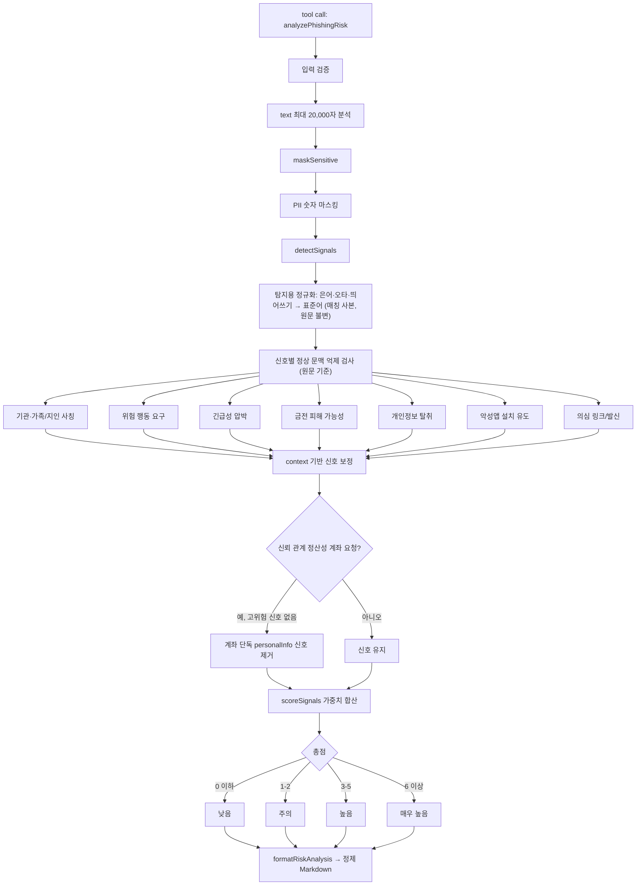

<details>
<summary><b>전체 처리 흐름 더 보기</b> · 요청 라우팅 / 신고 상황 선택 / 출력 분기 / getReportChannels</summary>

<br>

**MCP 요청 라우팅 (stateless)**

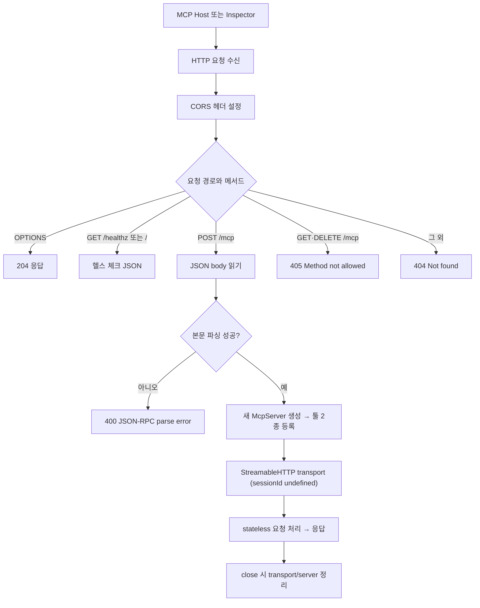

**context → 신고 상황(situation) 선택**

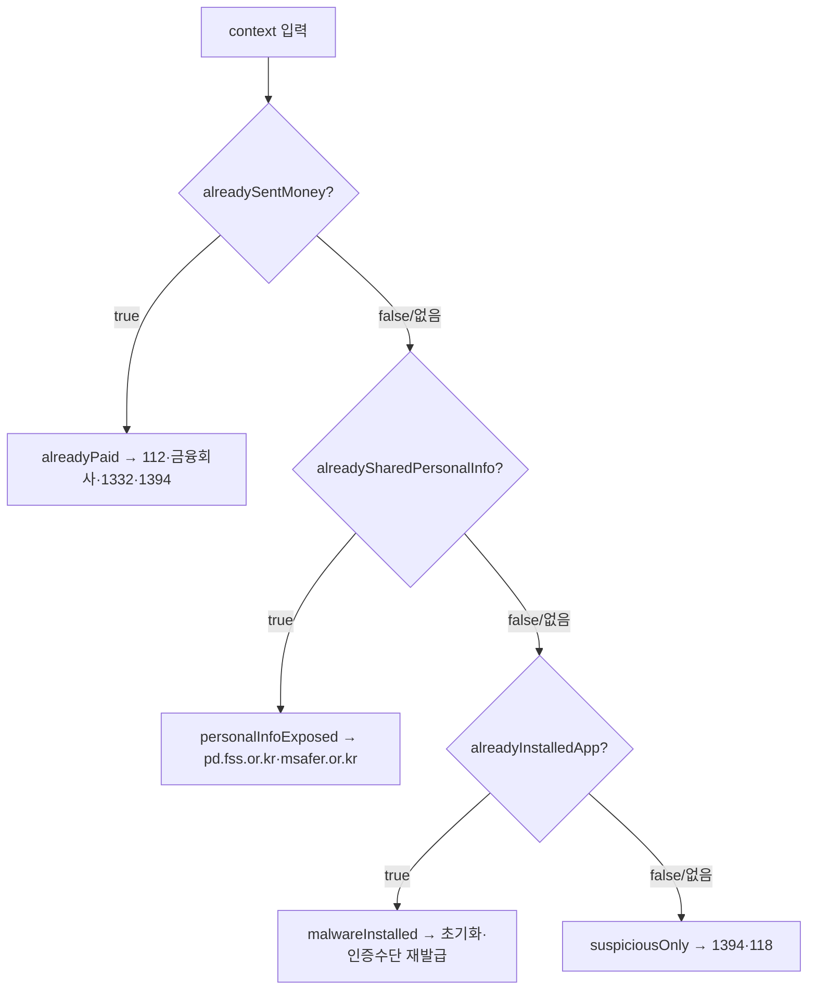

**출력 Markdown 분기**

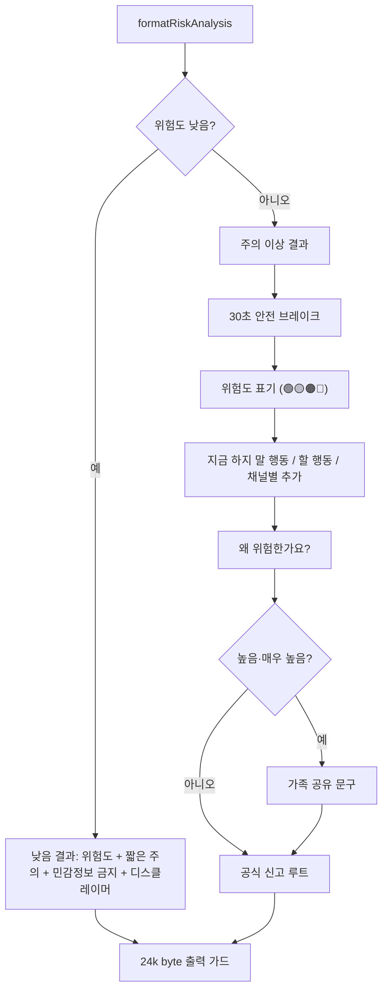

**getReportChannels 흐름**

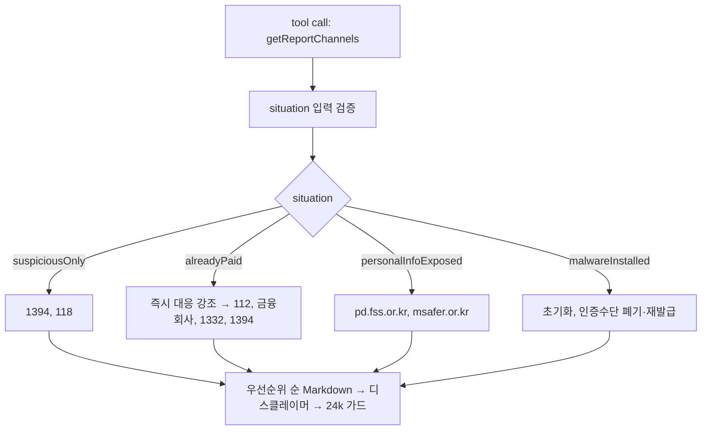

</details>

> 한 페이지 시각본: [PhishingSignal Flowchart (PDF)](docs/PhishingSignal-Flowchart.pdf)

<br>

## ⚙️ 요구 사항

- **Node.js 22 LTS** (`engines: ">=22"`)
- **npm**


<br>    

## 🚀 설치 / 빌드 / 실행

```bash
# 설치 / 빌드 / 서버 실행
node --version       
npm ci               
npm run build        
npm start            

# 개발 모드
npm run dev

# 타입체크 / 테스트
npm run typecheck
npm test
```

서버는 다음 엔드포인트를 제공합니다(기본 포트 3000):

- `POST /mcp` — MCP Streamable HTTP 엔드포인트
- `GET /healthz` — 헬스 체크 (`{"status":"ok",...}`)

```bash
PORT=3000 npm start
curl http://127.0.0.1:3000/healthz
```


<br>


## 🔎 MCP Inspector 점검

[MCP Inspector](https://github.com/modelcontextprotocol/inspector)로 스펙 준수를 확인합니다.

```bash
# 1) 서버 기동
PORT=3000 npm start

# 2-A) UI 모드: 브라우저에서 Transport=Streamable HTTP, URL=http://127.0.0.1:3000/mcp 로 연결
npx @modelcontextprotocol/inspector

# 2-B) CLI 모드(헤드리스)
npx @modelcontextprotocol/inspector --cli http://127.0.0.1:3000/mcp \
  --transport http --method tools/list

npx @modelcontextprotocol/inspector --cli http://127.0.0.1:3000/mcp \
  --transport http --method tools/call --tool-name getReportChannels \
  --tool-arg situation=suspiciousOnly
```

점검 포인트 : 툴 2종 노출, 각 툴의 `name/description/inputSchema/annotations(5종)`, 응답 마크다운(디스클레이머 포함), 응답 크기 24k 이내


<br>


## 🐳 Docker (PlayMCP in KC — Git 소스 빌드)

레포 루트의 [Dockerfile](Dockerfile)로 빌드합니다. (멀티스테이지, Node 22, 비루트 실행)

```bash
docker build -t phishing-signal-mcp .
docker run --rm -p 3000:3000 -e PORT=3000 phishing-signal-mcp
curl http://127.0.0.1:3000/healthz
```

> 재현 빌드를 위해 `npm ci`를 사용하므로 `package-lock.json`이 커밋되어 있어야 합니다.

<br>

## 📦 배포 (PlayMCP 콘솔)

1. 공개 Endpoint URL 확보 → 경로는 `https://<host>/mcp`
2. PlayMCP 개발자 콘솔에 임시 등록 → 도구함 추가 → AI채팅 테스트 → 심사 요청
3. 심사 통과 후 공개 상태를 "전체 공개"로 전환


